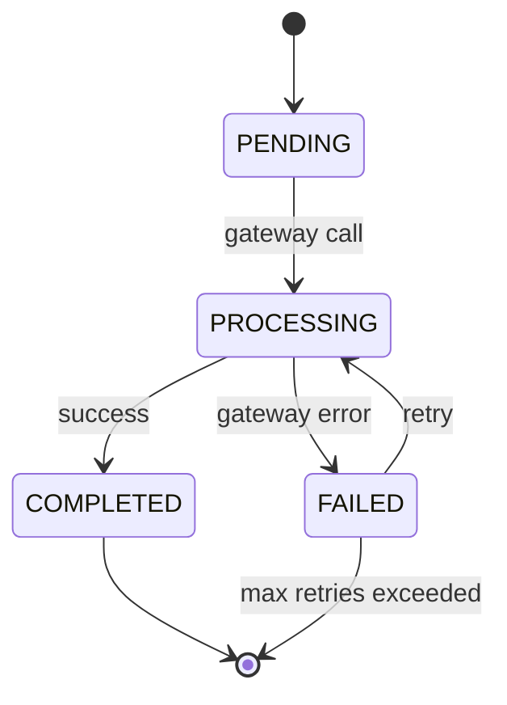

# Design Document Skill

Write structured technical design documents following the **4C framework**: Context, Contract, Core Logic, Corners.

## When to Use
- User says "write design doc", "requirement spec", "technical design", "API design"
- Planning a new feature, module, or system
- Defining interfaces between services or components
- Reviewing or refining existing design documents

---

## 4C Structure

Every design document must follow this order:

### 1. Context

Establish the problem space and scope.

Required elements:
- **Background**: What problem exists and why it matters now
- **Role**: Who interacts with this system and how
- **Boundary**: What is in scope and out of scope
- **Location**: Where this module lives in the system architecture (stack, service, layer)

Example:

```markdown
## Context

### Background
The payment service currently synchronously processes refunds during checkout,
causing 3s+ latency on the order confirmation page. Refund requests from the
merchant portal fail silently when the payment gateway is unavailable.

### Role
- Merchant: initiates refunds via portal
- Order Service: publishes refund events
- Payment Service: processes refunds against the gateway

### Boundary
In scope: async refund processing, retry with backoff, status tracking
Out of scope: partial refunds, multi-currency, fraud detection

### Location
payment-service / refund-module (between Order Event Consumer and Payment Gateway Adapter)
```

### 2. Contract

Define the interfaces and agreements.

Required elements:
- **Input**: What data comes in and from where
- **Output**: What data goes out and to where
- **Protocol**: Transport, format, serialization
- **Interface**: API signature, message schema, or function signature
- **Behavioral contract**: Preconditions, postconditions, idempotency, ordering guarantees

Example:

```markdown
## Contract

### Input
- RefundRequested event from Order Service (Kafka topic `order.refunds`)
- Schema: `{ orderId, paymentId, amount, reason, idempotencyKey }`

### Output
- RefundCompleted event (Kafka topic `payment.refunds.completed`)
- RefundFailed event (Kafka topic `payment.refunds.failed`)
- Refund status query API: `GET /refund/{id}/status`

### Protocol
- Kafka (JSON, at-least-once delivery)
- REST (JSON over HTTP/1.1)

### Behavioral Contract
- Idempotent: same `idempotencyKey` produces same result
- At-most-once execution per key
- Ordering: refunds for the same payment processed sequentially
```

#### API Designs

When the design involves REST APIs, include a **Swagger/OpenAPI 3.0 spec** inline:

```yaml
openapi: "3.0.3"
info:
  title: Refund API
  version: "1.0.0"
paths:
  /refunds:
    post:
      summary: Create a refund request
      requestBody:
        required: true
        content:
          application/json:
            schema:
              $ref: "#/components/schemas/CreateRefundRequest"
      responses:
        "201":
          description: Refund created
          content:
            application/json:
              schema:
                $ref: "#/components/schemas/RefundResponse"
        "409":
          description: Duplicate idempotency key
        "422":
          description: Invalid refund amount
components:
  schemas:
    CreateRefundRequest:
      type: object
      required: [paymentId, amount, idempotencyKey]
      properties:
        paymentId:
          type: string
          format: uuid
        amount:
          type: number
          format: decimal
          minimum: 0.01
        reason:
          type: string
          maxLength: 500
        idempotencyKey:
          type: string
          format: uuid
    RefundResponse:
      type: object
      properties:
        id:
          type: string
          format: uuid
        status:
          type: string
          enum: [PENDING, PROCESSING, COMPLETED, FAILED]
        createdAt:
          type: string
          format: date-time
```

### 3. Core Logic

Describe the main flow and module breakdown.

Required elements:
- **Flow**: Step-by-step happy path
- **Module split**: Key components and their responsibilities
- **Implementation path**: Critical decisions, algorithms, or patterns used

Keep it precise. Use numbered steps, not paragraphs.

Example:

```markdown
## Core Logic

### Flow
1. Consume RefundRequested event from Kafka
2. Deduplicate by idempotencyKey (Redis SETNX, TTL 24h)
3. Validate: payment exists, amount <= original charge, not already refunded
4. Persist RefundEntity with status=PENDING
5. Call Payment Gateway refund API
6. On success: update status=COMPLETED, publish RefundCompleted
7. On failure: update status=FAILED, publish RefundFailed, schedule retry

### Module Split
- RefundEventConsumer: Kafka listener, deserialization, dedup
- RefundService: validation, state machine, orchestration
- RefundGatewayAdapter: HTTP client to Payment Gateway
- RefundRepository: JPA access to refund table

### State Machine
PENDING → PROCESSING → COMPLETED
                    └→ FAILED → (retry) → PROCESSING
```

### 4. Corners

Cover edge cases, failures, and risks.

Required elements:
- **Edge cases**: Unusual but valid inputs or states
- **Failure paths**: What breaks and how to recover
- **Security risks**: Auth, authz, injection, data exposure
- **Exceptions**: Known limitations or deferred items

Example:

```markdown
## Corners

### Edge Cases
- Refund amount equals zero (reject with 422)
- Double-click on refund button (idempotencyKey prevents duplicate)
- Payment gateway timeout after charge already refunded (check gateway status before retry)

### Failure Paths
- Kafka consumer lag > 5min: alert ops, do not scale consumers (backpressure)
- Payment gateway 5xx: retry with exponential backoff (3 attempts, max 10min)
- Database unavailable: consumer pauses offset commit, retries after reconnect

### Security Risks
- Refund amount manipulation: validate against original charge server-side
- Unauthorized refund: verify caller has MERCHANT_ADMIN role on the target account
- PII in refund reason: truncate to 500 chars, no card numbers

### Exceptions
- Partial refunds: deferred to v2
- Cross-currency refunds: out of scope
```

---

## Writing Rules

### Language

- **Short sentences.** One idea per sentence.
- **Active voice.** "The service validates the amount", not "The amount is validated by the service".
- **No ambiguity.** Replace "should" with "must" or "may". "must" = required, "may" = optional.
- **No filler.** Cut words that add no information ("basically", "essentially", "in order to").
- **Concrete over abstract.** "Return 404" not "handle the error appropriately".

### Cross-References

Reference related documents at the top of the doc:

```markdown
## References

- [Payment Gateway Integration Spec](docs/payment-gateway-integration.md)
- [Order Event Schema](https://wiki.internal/schemas/order-events)
- Related skill: `spring-boot-patterns` for implementation patterns
```

### Diagrams

Use Mermaid for flow and state diagrams when they clarify the logic:

```markdown
### State Machine


```

---

## Document Template

```markdown
# [Feature Name] Design Document

## References
- [Related doc 1](link)
- [Related doc 2](link)

## Context
### Background
### Role
### Boundary
### Location

## Contract
### Input
### Output
### Protocol
### Interface
### Behavioral Contract
### API Specification (Swagger/OpenAPI if applicable)

## Core Logic
### Flow
### Module Split
### Implementation Path

## Corners
### Edge Cases
### Failure Paths
### Security Risks
### Exceptions
```

---

## Related Skills

- `spring-boot-patterns` — Implementation patterns for REST APIs
- `jpa-patterns` — Data layer design
- `test-quality` — Test strategy for the designed feature
